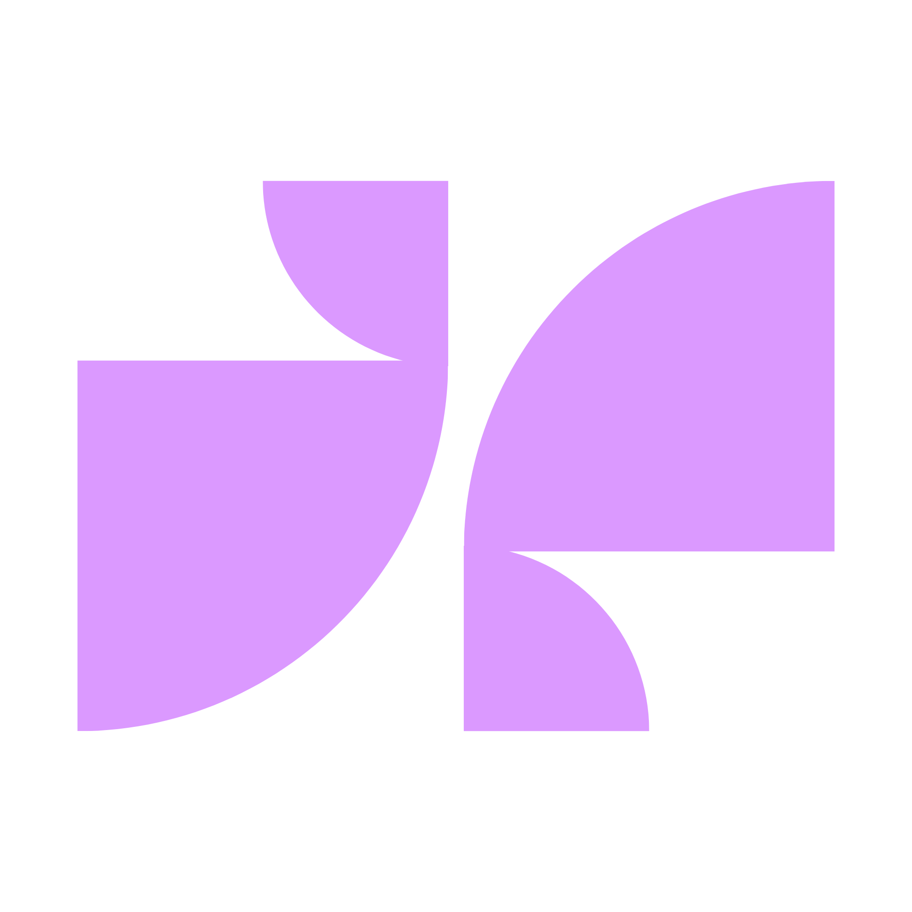

<div align="center">
  

  # 🌌 XENOAI
  
  **The future of conversation starts here.**

  [](https://github.com/matelex0/xenoai)
  [](LICENSE)
  [](https://github.com/matelex0/xenoai/stargazers)
  [](https://github.com/matelex0/xenoai/issues)

  <p align="center">
    <a href="#-features">✨ Features</a> •
    <a href="#-tech-stack">🛠️ Tech Stack</a> •
    <a href="#-roadmap">🗺️ Roadmap</a> •
    <a href="#-getting-started">🚀 Getting Started</a>
  </p>
</div>

---

## 🛸 About The Project

**XENOAI** is a next-generation public chatbot interface designed with a sleek, space-themed aesthetic. It aims to democratize AI access by providing a free, open entry point to advanced conversational models.

Unlike traditional platforms, **XENOAI** allows anyone to start chatting immediately without barriers.

> "Innovation is not just about the technology, it's about the experience."

---

## ✨ Features

- **🔓 No Login Required**: Start chatting instantly. Privacy by default.
- **💾 Optional Persistence**: Register an account only if you want to save and sync your chat history.
- **🎨 Innovative Design**: A deeply immersive "Dark Space" UI with dynamic canvas animations and shooting stars.
- **🤖 Powered by g4f**: Leveraging the [GPT4Free](https://github.com/xtekky/gpt4free) project to provide accessible AI intelligence.
- **📱 Fully Responsive**: Optimized for desktop, tablet, and mobile devices.

---

## 🛠️ Tech Stack

### Frontend (Current)


### Backend (Planned)


### AI Core


---

## 🗺️ Roadmap

### 🌑 Phase 1: UI/UX (Frontend) - *In Progress*
- [x] Design Landing Interface (Space Theme)
- [x] Implement Dynamic Star Background
- [x] Create Responsive Input & Layout
- [ ] Develop Chat Interface Transition
- [ ] Add Message Bubbles & Typing Effects

### 🌒 Phase 2: Core Logic (JS)
- [ ] Connect to `g4f` API (or Proxy)
- [ ] Handle Local Session History
- [ ] Markdown Rendering for AI Responses

### 🌓 Phase 3: Backend & Auth
- [ ] Set up Laravel Backend
- [ ] Implement User Registration/Login System
- [ ] Database Integration for Chat Persistence

### 🌔 Phase 4: Advanced Features
- [ ] Voice Input/Output
- [ ] Image Generation Support
- [ ] User Settings & Customization Panel

---

## 🚀 Getting Started

To run the frontend locally:

1. **Clone the repository**
   ```bash
   git clone https://github.com/matelex0/xenoai.git
   ```

2. **Navigate to project directory**
   ```bash
   cd xenoai
   ```

3. **Start a local server** (Python example)
   ```bash
   python -m http.server 8000
   ```

4. **Explore**
   Open `http://localhost:8000` in your browser.

---

## 📈 Star History

<a href="https://star-history.com/#matelex0/xenoai&Date">
 <picture>
   <source media="(prefers-color-scheme: dark)" srcset="https://api.star-history.com/svg?repos=matelex0/xenoai&type=Date&theme=dark" />
   <source media="(prefers-color-scheme: light)" srcset="https://api.star-history.com/svg?repos=matelex0/xenoai&type=Date" />
   
 </picture>
</a>

---

<div align="center">
  <sub>Built with 💜 by Matelex.</sub>
</div>
